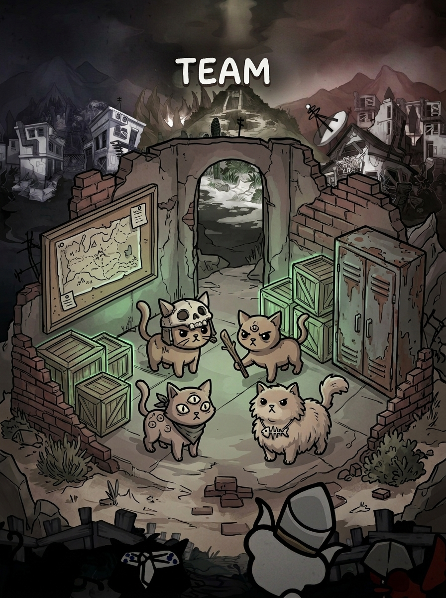
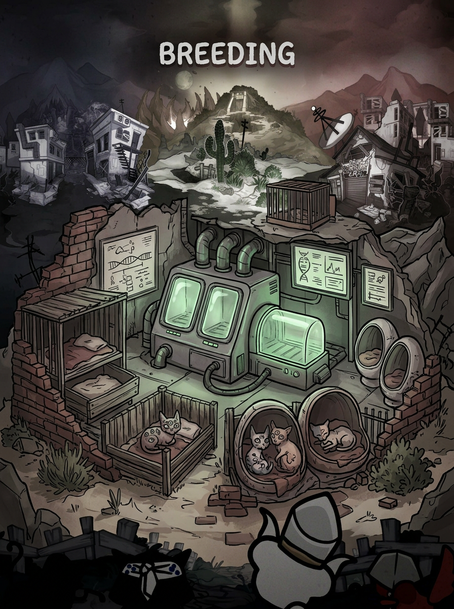

# Mewgent

> Live companion overlay for [Mewgenics](https://store.steampowered.com/app/Mewgenics) — real-time cat stats, breeding recommendations, and team management, right on top of your game.

| Team | Breeding |
| :---: | :---: |
|  |  |

---

## Features

- **Live save file watcher** — detects changes every 2 seconds, no manual refresh needed
- **Cat stats at a glance** — STR, DEX, CON, INT, SPD, CHA, LCK with visual charts
- **Breeding advisor** — scores every pair by class fit, stat synergy, and genetic traits
- **Team management** — track your roster, room assignments, and collar classes
- **LLM-powered advice** — optional OpenAI integration for natural language breeding strategy
- **Always-on-top overlay** — frameless, semi-transparent, toggle with `Ctrl+Shift+M`
- **Auto-detects your save file** — no manual path configuration needed

---

## Requirements

- Windows 10/11
- Python 3.11+
- [uv](https://docs.astral.sh/uv/) package manager

---

## Installation

```bash
# 1. Install uv (if not already installed)
# Windows (recommended):
winget install --id=astral-sh.uv
# macOS / Linux:
curl -LsSf https://astral.sh/uv/install.sh | sh

# 2. Clone the repository
git clone https://github.com/ml-datadogs/mewgent.git
cd mewgent

# 3. Install dependencies
uv sync

# 4. Run
uv run python -m src.main
```

The overlay will appear and auto-detect your Mewgenics save file.

---

## LLM advice (optional)

To enable AI-powered breeding recommendations, set your OpenAI API key and enable the feature in `config/settings.yaml`:

```yaml
llm:
  enabled: true
  model: "gpt-4o-mini"
```

Then create a `.env` file in the project root (use `.env.example` as a template):

```
OPENAI_API_KEY=sk-...
```

---

## Configuration

Edit `config/settings.yaml` to customize behavior:

| Key | Default | Description |
|---|---|---|
| `save_file.path` | `""` | Save file path — auto-detected if empty |
| `save_file.poll_interval_ms` | `2000` | How often to check for save changes |
| `llm.enabled` | `false` | Enable OpenAI-powered advice |
| `llm.model` | `"gpt-4o-mini"` | OpenAI model to use |
| `hotkey.toggle` | `"Ctrl+Shift+M"` | Hotkey to show/hide the overlay |
| `overlay.opacity` | `0.92` | Overlay transparency (0.0–1.0) |

---

## Development

### Run with mock data (no game needed)

Works on macOS and Linux too:

```bash
uv run python -m src.main --dev-ui
```

### Frontend (React + TypeScript)

```bash
cd ui
npm install
npm run dev      # Vite dev server on port 5173
npm run build    # production build → ui/dist/
```

### Linting & type checking

```bash
ruff check .             # Python lint
ruff format --check .    # Python format check (no writes)
ty check                 # Python type check
cd ui && npm run lint    # TypeScript lint
```

### Tests

```bash
pytest
```

### Build release executable

```bash
cd ui && npm ci && npm run build && cd ..
uv run pyinstaller mewgent.spec --noconfirm
# Output: dist/mewgent/mewgent.exe
```

---

## Project structure

```
src/
  main.py          # Entry point
  capture/         # Save file watcher (real + mock)
  data/            # Save parser, stat extractor, collars, furniture
  breeding/        # Pair scoring and breeding calculator
  ui/              # PySide6 overlay + Qt WebChannel bridge
  llm/             # OpenAI advisor
  wiki/            # Game wiki scraper
  utils/           # Config loader, logging, update checker
ui/                # React + TypeScript frontend
config/            # settings.yaml
tests/             # pytest tests + fixtures
```

---

## License

[MIT](LICENSE) — not affiliated with or endorsed by the Mewgenics developers.
