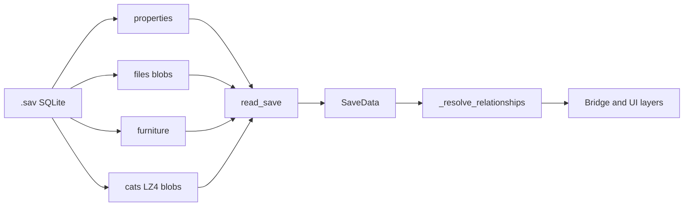

# Mewgenics save file parsing

This document describes how Mewgent reads a Mewgenics `.sav` file. The implementation lives in [`src/data/save_reader.py`](../src/data/save_reader.py). The on-disk layout is **reverse-engineered**; the cat blob layout in particular follows the approach proven in **MewgenicsBreedingManager** (as noted in that module).

## Overview

A `.sav` file is a **SQLite** database. Opening it requires **SQLite 3.37.0 or newer** because the game uses `STRICT` tables (`read_save` connects with the standard library `sqlite3`).

At a high level, Mewgent:

1. Reads scalar keys from the **`properties`** table.
2. Reads large binary payloads from the **`files`** table (keyed by string, e.g. `house_state`).
3. Reads one row per placed item from **`furniture`** and aggregates stats per room.
4. Reads **`cats`** rows, decompresses each `data` blob, and parses the flat binary into a `SaveCat`.
5. Runs **`_resolve_relationships`** to attach parents, children, and generation from the pedigree map.

The module docstring also lists **`winning_teams`** as part of the schema; Mewgent does not read that table yet.

## Where saves live and when they are read

On Windows, `find_save_files()` looks under:

`%APPDATA%\Glaiel Games\Mewgenics\<steam_id>\saves\*.sav`

The overlay’s [`SaveWatcher`](../src/capture/save_watcher.py) polls the configured path’s modification time and calls `read_save` when it changes. Path selection and watcher wiring are in [`src/main.py`](../src/main.py).

## SQLite tables Mewgent uses

| Table | Role |
| --- | --- |
| `properties` | `current_day`, `house_gold`, `house_food`, `owner_steamid` (typed as int or str when read). |
| `files` | Binary blobs addressed by `key` (`house_state`, `pedigree`, `adventure_state`, `house_unlocks`, `unlocks`, plus `inventory_backpack`, `inventory_storage`, `inventory_trash`). |
| `furniture` | Per-item blobs: name, room, plus wiki-derived stat contributions. |
| `cats` | Integer `key` (database cat id) and LZ4-wrapped `data` blob per cat. |

## Cat rows: LZ4 wrapper

Each `cats.data` value is:

1. **4 bytes**, little-endian `uint32`: uncompressed size (`uncompressed_size`).
2. **Remaining bytes**: LZ4 **block** payload, decompressed with `lz4.block.decompress(..., uncompressed_size=uncompressed_size)`.

`_decompress_blob` rejects blobs shorter than 8 bytes, non-positive sizes, or sizes above **100_000** bytes, then returns the decompressed flat record (or `None` on failure).

## Flat cat binary (after LZ4)

Parsing uses an internal **`_BinaryReader`**: all multi-byte integers are **little-endian**. Important primitives:

- **`u32` / `i32` / `f64`**: standard LE scalars.
- **`u64`**: two consecutive LE `u32` values combined into one integer (used for length fields).
- **`utf16str()`**: `u64` character count, then that many UTF-16LE code units (bytes = count × 2).
- **`str()`**: `u64` byte length, then UTF-8 (invalid sequences ignored). Lengths above **10_000** abort the read and yield `None`.

### Field order (sequential read)

After decompression, `_parse_flat_cat_inner` walks the buffer in order (see `_parse_flat_cat` docstring for a compact offset summary):

1. **`u32` `breed_id`**
2. **`u64` unique id** (exposed as hex string)
3. **UTF-16LE `name`** (empty name abandons the cat)
4. **UTF-8 length-prefixed `name_tag`**; reader position after this is the **`personality_anchor`** (used for gender byte and fixed-offset personality fields)
5. If `name_tag` is in `KNOWN_CLASSES`, it becomes **`active_class`**
6. Two **`u64` parent UIDs** (read but **not** used for lineage; **`pedigree`** is authoritative)
7. **UTF-8 `collar`**, then **`u32` padding**
8. **`skip(64)`**, then **72 × `u32`** visual mutation table `T`  
   - `body_parts` uses `T[0]`, `T[3]`, `T[8]`  
   - `visual_mutation_ids` collects selected slots from `_VISUAL_MUTATION_FIELDS`, skipping zeros, `0xFFFFFFFF`, defect band **700–706**, sentinel **`0xFFFFFFFE`**, and only keeping ids **≥ 300** when not defects
9. **3 × `u32`** gender token fields
10. **UTF-8 `raw_gender` string**; gender is resolved from **`data[personality_anchor]`** as `sex_code` (`0` male, `1` female, `2` `?`) when possible, else `_normalize_gender(raw_gender)`
11. **`f64` breed coefficient** (kept only if in **[0, 1]**)
12. **7 × `u32` base stats**, **7 × `i32` stat_mod**, **7 × `i32` stat_sec** → `total_stats` sums the three layers per stat name (`str`, `dex`, `con`, `int`, `spd`, `cha`, `lck`)
13. From **`personality_anchor`**: **`f64`** at **+32** libido, **+40** inbredness, **+64** aggression (each validated finite and in **[0, 1]**)
14. **`u32` candidates at anchor +48 and +72** for lover / hater **database keys** (filtered later to cats that exist)
15. **`_parse_abilities`**: scans ahead for a length-prefixed ASCII **`"DefaultMove"`** marker, then reads a run of identifier-like UTF-8 strings to fill **abilities**, **passives**, **disorders**; if no marker, a **heuristic** string scan fills abilities/equipment/passives instead
16. If **`current_day > 0`**, scans several **offsets from the end** of the blob for a **`u32` `creation_day`**; first plausible value yields **`age = current_day - creation_day`** (capped logic in code)
17. **Single byte at `len(data) - 66`**: non-zero ⇒ **`retired`**

## `files` table blobs

| Key | Parser | Meaning |
| --- | --- | --- |
| `house_state` | `_parse_house_info` | **`u32` count** at offset **4**; records start at offset **8**. Each record: **`u32` cat_key**, 4-byte pad, **`u32` room_len**, 4-byte pad, **`room_len` ASCII bytes**, then **24** trailing bytes. Only keys **1..10000** are kept → `room_assignments`. |
| `pedigree` | `_parse_pedigree` | From offset **8**, repeating **32-byte** records: **`u64` cat**, **`u64` parent_a**, **`u64` parent_b**, **`u64` extra**. **`0xFFFFFFFFFFFFFFFF`** means null for parents. Keys above **1_000_000** skipped; duplicate cat rows may be merged when a fuller pair of parents appears. |
| `adventure_state` | `_get_adventure_keys` | Same count-at-4 pattern; each entry is **`u64`**; cat db key is **high 32 bits** `(val >> 32) & 0xFFFFFFFF`. |
| `house_unlocks` | `_get_unlocked_house_rooms` | Not a strict struct: **regex token scan** on ASCII-like identifiers, then **heuristic** mapping to internal room keys (`Floor1_Large`, `Attic`, etc.). |
| `unlocks` | `_parse_unlocks` | **`u32` number of categories**; each category: **`u32` count**, **`u32` padding**, then **`count`** times **`i64` length** + **ASCII string**. **First three categories** map to unlocked classes, active abilities, passive abilities (by index **0, 1, 2** in the parsed list). |
| `inventory_backpack` | `_parse_inventory_blob` | Often **four zero bytes** when empty. Otherwise encodes carried items; internal ids appear as **null-terminated ASCII** in the blob. |
| `inventory_storage` | `_parse_inventory_blob` | House storage; **per-record byte length varies**, so the parser scans for embedded identifier-like strings (same filter as cat ability ids) instead of stepping a fixed stride. |
| `inventory_trash` | `_parse_inventory_blob` | Discarded items; same string scan as storage. The leading **`u32` often matches entry count** in practice but is not relied on for parsing. |

## `furniture` rows and room stats

Each `furniture.data` blob (minimum length checked):

- **`u32` version** (expected **1** in practice)
- **`u64` name length** (low **`u32`** + high **`u32`**, high assumed **0**), **ASCII name**
- **`u64` unused** (empty-string slot between name and room)
- **`u64` room length**, **ASCII room id**
- **5 × `i32`** placement metadata (read via reader position; not exposed on `RoomStats`)

Appeal, comfort, stimulation, health, and mutation come from **`FURNITURE_STATS`** in [`src/data/furniture_stats.py`](../src/data/furniture_stats.py) (wiki-sourced lookup by furniture name). Unknown names are **logged** and contribute no stats. After parsing, **`cat_count` per room** is merged from `house_state` assignments. Entries with an empty room key are dropped from `room_stats`.

## Derived fields on `SaveData` / `SaveCat`

These are **not** a single field in one blob; they are computed in `read_save` or `_resolve_relationships`:

- **Cat `status`**: `adventure` if db key in `adventure_state`; else `in_house` if key in `house_state`; else `dead` if **`age == 0`** after parsing; else `historical`.
- **`room`**: from `house_state` when in house.
- **`parent_a_key` / `parent_b_key`**: from `pedigree` for keys that exist in the loaded cat list.
- **`children_keys`**: inverse of parent links.
- **`lover_keys` / `hater_keys`**: filtered to keys that exist in the save.
- **`generation`**: iterative depth from parents (cycles guarded; unresolved falls back to **0**).
- **`inventory_*` lists** (wiki-backed JSON files: [`generated-data.md`](generated-data.md)): each entry is an `InventoryItem` with **`item_id`** (internal game name). Order follows discovery order in the blob; duplicates can appear if the save stores multiple stacks as separate records. Effect text comes from **`item_effects_wiki.json`**, table art URLs from **`item_icons_wiki.json`**, and the wiki **Slot** column from **`item_slots_wiki.json`** (same keys; regenerate with `uv run python tools/generate_item_effects_wiki.py`). Icons are absolute ``https://mewgenics.wiki.gg/images/ITEM_*.svg`` links for use in the Web UI. Stat modifiers append the wiki icon label (e.g. ``-99 Luck``). Shield-only rows use ``/wiki/Shield`` without a text label; those become ``+N Shield`` (e.g. Cursed Rock). Rows whose display name includes a parenthetical variant use keys like ``BrokenMirror_Trinket`` vs ``BrokenMirror_HeadArmor``. Save ids that differ from wiki keys (or have no matching row) are listed in **`ITEM_ID_ALIASES`** in [`src/data/item_effects.py`](../src/data/item_effects.py) (e.g. `SurvivalistGaiter` → `Survivalist'sGaiter`, `CatnipBig` → `LargeCatnipBaggy`, `DryBoneHat` → `DryBoneHelm`). Some game ids such as **`LuckyMask`** still have no row on the Items wiki page — effects/icons/slots stay empty until the wiki lists them or an alias is added.
- **Cat `equipment`**: up to **five** internal item id strings read from the cat blob in the heuristic layout (when the `DefaultMove` layout is present this list is left empty). WebChannel **`cat`** JSON exposes **`equipment`** as `{ item_id, effect, icon_url, slot }[]` using the same lookup. **Team / collar scoring** still uses base stats only; numeric combat bonuses from items are not folded into `collar_score`. LLM team suggestions can use backpack + storage plus wiki slot/effect text to propose **`inventory_tips`** (merged into the synergy string in the UI).

## Data flow (implementation)

## Limitations and debugging

- **Game updates** can change blob layouts or add fields; the parser uses validation, fallbacks (e.g. abilities without `DefaultMove`), and logging rather than failing the whole read.
- **Regression tests**: [`tests/test_save_reader.py`](../tests/test_save_reader.py) assert behavior against a checked-in fixture save.
- **Verbose inspection**: set logging to **DEBUG**; `_dump_save_debug` emits a structured dump of parsed save data when the `mewgent.data.save_reader` logger allows it.
